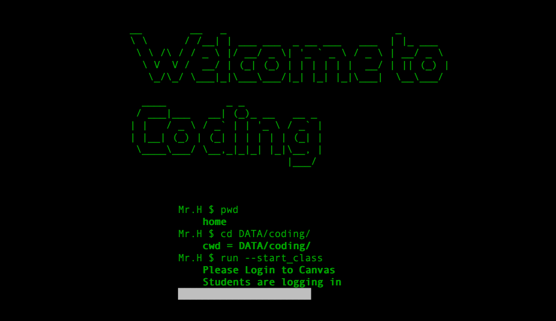

## Olá 👋

<!--
**SeuNome/SeuNome** é um ✨ _repositório especial_ ✨ porque seu `README.md` (este arquivo) aparece no seu perfil do GitHub.

Aqui estão algumas ideias para começar:

- 🔭 Atualmente estou trabalhando em ...
- 🌱 Atualmente estou aprendendo ...
- 👯 Estou procurando colaborar em ...
- 🤔 Estou procurando ajuda com ...
- 💬 Pergunte-me sobre ...
- 📫 Como me contatar: ...
- 😄 Pronomes: ...
- ⚡ Curiosidade: ...
-->

### Eu sou Vitor Hugo

Pentester | Ethical Hacker | Hack is not a crime

 

 

💻 Pentester.

🏠 I'm from Brazil.

📚 I'm currently learning everything about IT and Security.

## Social Networks

    
    

## Programming Languages

